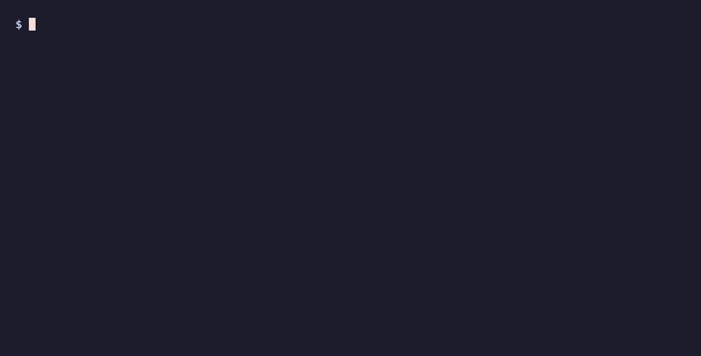

# ataegina

> Runtime isolation for git worktrees — collision-free ports, processes, **and
> databases** for every worktree, from one zero-dependency bash file. No Docker,
> no daemon, no YAML.

[](https://github.com/noahhyden/ataegina-cli/actions/workflows/ci.yml)
[](https://github.com/noahhyden/ataegina-cli/releases)
[](LICENSE)
[](#requirements)
[](#platforms)



Run a fleet of AI coding agents in parallel and they all fight over the same
machine — same ports, same dev server, one shared database they stomp in
unison. It's the same collision a human hits checking out three branches of a
full-stack app at once. ataegina gives every agent — and every branch you check
out — its own ports, processes, **and database**, collision-free, from one
zero-dependency bash file. **No Docker, no daemon, no YAML.**

The per-worktree *database* deconfliction is the part nobody else does locally
without a container: each worktree boots against its own DB, so parallel work
never shares schema or data.

Named after the Lusitanian goddess of rebirth.

## Contents

- [The problem](#the-problem)
- [What it ships](#what-it-ships)
- [Install](#install)
- [Quickstart](#quickstart)
- [Platforms](#platforms)
- [Commands](#commands)
- [How the launcher works](#how-the-launcher-works)
  - [Per-worktree databases](#per-worktree-databases)
  - [Scope-aware startup](#scope-aware-startup)
  - [Diagnostics](#diagnostics)
  - [Configuration keys](#configuration-keys)
- [Updating](#updating)
- [Requirements](#requirements)
- [Contributing](#contributing)
- [Security](#security)
- [License](#license)

## The problem

The moment you run more than one copy of a repo at once — a few AI coding agents
working in parallel worktrees, or just two feature branches side by side — the
whole stack collides. Every worktree's dev server tries to bind the same ports
(5173, 8000, whatever your stack uses), so the second to boot dies on "address
already in use." They share one dev database, so they stomp each other's schema
and data. And the background processes pile up untracked until you're hunting
PIDs by hand.

The usual fixes each cost something: containerize everything (Docker overhead,
re-install deps per environment), run a daemon or a reverse proxy, or hand-write
a Procfile / compose / Tilt file per project. ataegina takes none of that — it
makes N worktrees coexist on the bare host with one small launcher.

## What it ships

`ataegina` is a worktree-aware dev launcher. It gives every git worktree a stable
index N and derives everything collision-free from it:

- **Ports** — frontend `5173+N`, backend `8000+N`: predictable and sticky across
  runs, so long-lived worktrees keep stable addresses.
- **Database** — a separate per-worktree database, its connection string injected,
  created on `up`. The primary checkout keeps your shared dev DB.
- **Processes + logs** — detached dev servers tracked per worktree; `up` / `down`
  / `logs` act on exactly this tree's stack, nothing else's.

`ataegina init` detects your stack and writes the config; from then on
`ataegina up` brings this tree's whole stack up on its own slot. You keep your
own start commands — ataegina does the deconfliction and the bookkeeping.

## Install

ataegina is a single bash file. Installing it never requires `sudo`: it lives
under your home directory and writes only there.

**Homebrew (macOS / Linuxbrew).** Install and upgrade from the tap:

```bash
brew install noahhyden/tap/ataegina
```

This installs the `ataegina` binary and an `ate` shortcut; `brew upgrade` picks
up new releases.

**One command (curl).** No Homebrew required:

```bash
curl -fsSL https://raw.githubusercontent.com/noahhyden/ataegina-cli/main/install.sh | sh
```

The installer downloads the latest released `ataegina` into `~/.local/bin`,
verifies its SHA-256 (when a checksum is published), `bash -n` parse-checks it,
makes it executable, and prints the exact PATH line to add if `~/.local/bin` is
not already on your PATH. It never uses `sudo` and never edits your shell rc for
you. Override the install dir with `ATE_BIN` (or `PREFIX`). The installer is a
small, readable file: read it before you pipe it to a shell if you prefer.

**Manual single file (no sudo).** Download, make executable, and put it anywhere
on your PATH:

```bash
curl -fsSLO https://raw.githubusercontent.com/noahhyden/ataegina-cli/main/ataegina
chmod +x ataegina
mv ataegina ~/.local/bin/        # or any dir already on your PATH
```

If `~/.local/bin` is not on your PATH, add it (zsh shown; use `~/.bashrc` for
bash) and restart your shell:

```bash
echo 'export PATH="$HOME/.local/bin:$PATH"' >> ~/.zshrc
```

Optional but recommended short alias:

```bash
echo "alias ate='ataegina'" >> ~/.zshrc   # or ~/.bashrc
```

You never need `sudo` for any of these paths. (You *may* symlink the file into a
system dir like `/usr/local/bin` yourself, but that is your choice, not a
requirement.)

## Quickstart

```bash
# 1. Configure your stack. `init` detects it and writes ataegina.config.sh.
ataegina init               # interactive: confirm each detected value
# ataegina init --yes       # accept all detected values (no prompts; CI/scripts)
# ataegina init --dry-run    # preview the config without writing it

# 2. In any worktree, start its dev servers on a collision-free port slot.
cd ../my-feature-worktree
ataegina up
ataegina ports     # show this tree's index + urls
```

`ataegina init` probes for your frontend and backend (Next, Nuxt, Astro,
SvelteKit, Vite, CRA on the frontend; uv/poetry, Django, Rails, Express/Nest,
Go, Rust/Cargo, PHP/Laravel on the backend), derives a
per-slot start command for each (overriding any port pinned in a `dev` script),
and writes a declarative `ataegina.config.sh`. It is interactive by default
(each detected value is offered as the prompt default, empty input accepts it);
`--yes` / `--non-interactive` (and any non-tty stdin) skips the prompts. An
undetected stack gets a clearly-commented TODO template instead. Print the
version with `ataegina --version`.

The primary checkout is index 0. Each additional worktree gets the next free
index N, and:

```
frontend port = FRONT_PORT_BASE + N   (default 5173 + N)
backend  port = BACK_PORT_BASE  + N   (default 8000 + N)
log dir       = LOG_DIR_BASE + N       (default /tmp/ate-wtN)
```

The mapping is sticky: a worktree keeps the same index (and therefore the same
ports) across runs, so long-lived background agents keep stable addresses.

## Platforms

ataegina is plain bash 3.2 with no bash-4-only constructs, so it runs on the
macOS system shell as-is and on Linux natively. The portability story is not the
shell dialect, it is the external tools it shells out to for port operations.
`git` is required everywhere; a port backend (`lsof`, `ss`, `fuser`, or a
`/proc/net/tcp` parse) is auto-detected, so a box missing `lsof` still works as
long as one of those is present.

- **Linux: full.** A developer box with `lsof` is full support. A minimal
  Debian/Ubuntu image may lack `lsof`; ataegina then falls back to `ss`
  (iproute2, near-universal), `fuser`, or a `/proc/net/tcp` parse. If you want
  the simplest path, `apt-get install lsof`.
- **macOS: full.** Works on the system `/bin/bash` 3.2; no Homebrew bash needed.
  `lsof` and `git` ship with the OS / Xcode command-line tools.
- **Windows: WSL2 is full and recommended.** Inside WSL2 it is just Linux (same
  `lsof` note as above). Git Bash / MSYS2 is partial: the launcher bookkeeping
  and `init` work, but detached process tracking (so dev servers outlive the
  shell, pid-liveness checks) is unreliable under the MSYS layer, so prefer
  WSL2. Native PowerShell / cmd is not supported (it is a bash program end to
  end).

| Feature | macOS | Linux (lsof) | Linux (minimal) | WSL2 | Git Bash / MSYS2 | PowerShell / cmd |
|---|---|---|---|---|---|---|
| launcher (`up`/`down`/`ports`/`list`/`prune`) | full | full | partial (port ops via `ss`/`fuser`/`proc` fallback) | full | partial | no |
| init (scaffolder) | full | full | full | full | full | no |
| doctor (read-only) | full | full | partial (port checks via fallback) | full | partial | no |

"partial" on a minimal Linux box collapses to "full" the moment `lsof` is
installed (or whenever `ss`/`fuser`/`/proc` is available, which is almost
always).

### Commands

| Command | What it does |
|---|---|
| `ataegina init [options]` | Detect your stack and write a declarative `ataegina.config.sh` (interactive by default; `--yes`, `--dry-run`, `--force`, `--frontend-dir`, `--backend-dir`) |
| `ataegina up [both\|backend\|frontend] [--scope X]` | Start dev servers (default `both`) on this tree's port slot; `--scope frontend\|backend\|both\|none` forces the start scope (see "Scope-aware startup") |
| `ataegina down [both\|backend\|frontend]` | Stop them (kills by port, and by the pid it launched so nothing orphans) |
| `ataegina logs [both\|backend\|frontend] [-n N] [--no-follow]` | Follow this tree's server logs live (scoped to the current worktree) |
| `ataegina db [name\|url\|create\|drop]` | Inspect/manage this tree's database (when `DB_NAME` is set) |
| `ataegina ports` | Print this tree's index, ports, and urls |
| `ataegina move N` | Relocate this worktree to index `N` (and its derived port slot); stops the old slot's servers, refuses an index another live worktree holds, and rejects index 0 |
| `ataegina list` | List every registered worktree (flags stale entries) |
| `ataegina prune` | Drop registry entries whose worktree directory is gone |
| `ataegina doctor` | Run read-only diagnostics for this tree (never mutates; nonzero exit on a hard failure, so it works as a CI gate) |
| `ataegina config <get\|set\|list\|unset\|path> [...]` | Read or change config values without opening the file (see "Configuration") |
| `ataegina update` | Self-replace with the latest published release, checksum-verified, with a `.bak` rollback (see "Updating") |

Flag / env:

| Flag / env var | Effect |
|---|---|
| `ataegina --version` / `-v` | Print the version and exit |
| `ataegina --help` / `-h` | Print full usage and exit |
| `ATE_INDEX=<n>` | Force a specific index for one invocation (bypass auto-assign) |
| `ATE_CONFIG=<path>` | Use an explicit config file path |
| `ATE_REGISTRY_DIR` | Override the registry root (per-repo files go under its `repos/`) |
| `ATE_REGISTRY` | Pin one explicit registry file, shared across repos (overrides the per-repo default) |

**Configuration.** The config lives in `ataegina.config.sh`, but you rarely open
it: `ataegina init` writes it for you, and `ataegina config set/get/list` reads
and changes values from the command line. `ataegina config set FRONTEND_CMD '...'`
fixes a detected value, `ataegina config get BACK_PORT_BASE` reads one,
`ataegina config list` shows the effective values, `ataegina config unset KEY`
removes one, and `ataegina config path` prints which file won resolution. The
file stays the source of truth (it is sourced bash, so `*_CMD` values can still
reference `$FRONTEND_PORT` and you can still define hook functions in it); the
subcommand just means the common post-`init` tweaks need no text editor.

## How the launcher works

The launcher anchors on the worktree you run it *from* (`$PWD`'s git toplevel),
not on where the script lives, so you can keep one copy on your PATH and it does
the right thing in every checkout.

**Stable index assignment.** Indices live in a tab-separated registry (one
`index<TAB>path` line per worktree). The registry is **per repo**: each primary
checkout gets its own file under `~/.config/ataegina/repos/<key>`, where `<key>`
is the primary's directory name plus a portable digest of its path. Two unrelated
repos therefore never share an index space, so each one's primary is index 0 and
worktree indices never leak between repos. The next index handed out within a
repo is the lowest positive integer not currently claimed; because the mapping
persists, the same tree always gets the same ports. Set `ATE_REGISTRY` to pin a
single explicit registry file (shared across repos) instead.

**Index recycling.** Deleting a worktree does not clear its registry entry, so
slots slowly accumulate. `list` flags entries whose path no longer exists;
`prune` removes them, freeing those indices for the next new worktree to reuse.

**Relocating a worktree.** If an auto-assigned slot lands on a port some other
process permanently holds (so the derived port can never bind), `ataegina move N`
moves this worktree to index `N` and its port pair, rewriting the registry. It
stops the old slot's servers first (so nothing orphans on the old ports),
refuses an index another live worktree already holds, rejects index 0 (reserved
for the primary), and warns if either new port is already in use.

**You own the servers, but you rarely write bash.** ataegina does not assume a
stack. It exports a small, predictable environment, then starts each server:

```
ATE_INDEX               this worktree's stable index N
REPO_ROOT               absolute path to this worktree
FRONTEND_PORT           FRONT_PORT_BASE + N
BACKEND_PORT            BACK_PORT_BASE  + N
PORT                    same as the relevant *_PORT (convenience)
BACKEND_URL             http://localhost:$BACKEND_PORT
FRONTEND_URL            http://localhost:$FRONTEND_PORT
FRONTEND_API_BASE_URL   http://localhost:$BACKEND_PORT  (same value as BACKEND_URL)
DEV_LOG_DIR             this worktree's log dir
ATE_DB_NAME             this worktree's database name (only when DB_NAME is set)
```

**Declarative config (the common case).** Set `FRONTEND_DIR` / `FRONTEND_CMD`
(and optionally `FRONTEND_ENV`) plus the `BACKEND_*` equivalents in
`ataegina.config.sh` and ataegina's built-in hooks do the rest: `cd` into the
directory, export the extra env, and run the command in the background, logged
to the per-tree log dir. `*_CMD` is a string passed to `sh -c`, so it can
reference `$FRONTEND_PORT` / `$BACKEND_PORT` / `$BACKEND_URL`. `ataegina init`
writes this form for you.

```sh
FRONTEND_DIR='frontend'
FRONTEND_CMD='npx next dev -p $FRONTEND_PORT'
FRONTEND_ENV='NEXT_PUBLIC_API_BASE_URL=$BACKEND_URL'
BACKEND_DIR='backend'
BACKEND_CMD='uv run uvicorn main:app --port $BACKEND_PORT'
```

**Escape hatch (power users).** If your stack needs more than a command string
(a process manager, docker compose, several processes, a readiness wait),
define `ate_start_frontend` / `ate_start_backend` (and optionally the matching
`ate_stop_*`) in `ataegina.config.sh`. A hook you define **overrides** the
declarative default, so you take full control. See
`ataegina.config.example.sh` for both forms worked through.

### Per-worktree databases

Running many worktrees as live stacks collides on the **database** as much as on
ports: parallel agents stomp each other's schema and data through one shared dev
DB. Most tools punt on this, or solve it only by going full-container. ataegina
deconflicts the database on the bare host too.

Set `DB_NAME` and it is on (it is off otherwise, so existing configs are
unaffected). Each worktree N>0 gets its own database `DB_NAME` + `DB_SUFFIX` + N
(e.g. `myapp_wt3`); its connection string is built from `DB_URL_TEMPLATE` and
injected as `DATABASE_URL` (or whatever `DB_URL_VAR` names); and `ataegina up`
creates it before the backend starts. The **primary** (index 0) keeps the
unsuffixed `DB_NAME` — your shared dev DB — so only the parallel worktrees fork
off it.

```sh
DB_NAME=myapp
DB_KIND=postgres                                    # postgres | mysql | sqlite
DB_URL_TEMPLATE='postgres://localhost:5432/$ATE_DB_NAME'
```

`down` **never** drops a database, so your data survives a restart. Manage them
explicitly with `ataegina db [name|url|create|drop]` (dropping the primary's DB
is refused). Defaults per `DB_KIND` use the standard CLIs (`createdb`/`dropdb`,
`mysql`, a sqlite file); override with `DB_CREATE_CMD` / `DB_DROP_CMD`, or define
the `ate_db_create` / `ate_db_drop` hooks to point at a managed provider's branch
API instead (Neon, PlanetScale, Turso). `$ATE_DB_NAME` is exported into all of
them.

### Scope-aware startup

Most tasks touch only one surface. A worktree that is changing only the
frontend does not need its own backend process; it can talk to the backend the
primary checkout is already serving. `ataegina up` uses this to start only what
a tree needs and point everything else at the shared default servers (frontend
`FRONT_PORT_BASE`, backend `BACK_PORT_BASE`, the primary's slot).

**What it detects.** At `up` time, ataegina classifies the worktree's changes
into a *scope* of `frontend`, `backend`, `both`, or `none`. The signal is a
sampled git diff: the union of what this branch committed since it forked, the
staged and unstaged working changes, and untracked files. Each changed path is
prefix-matched against `FRONTEND_DIR` / `BACKEND_DIR`:

- changes only under `FRONTEND_DIR` -> `frontend`
- changes only under `BACKEND_DIR` -> `backend`
- changes under both -> `both`
- any change *outside* both dirs (shared libs, a schema, root config, a
  lockfile, CI) -> `both`, conservatively, because such a change can affect
  either surface and guessing wrong is the expensive failure
- nothing changed -> `none`

The diff base is resolved in this order: `ATE_BASE_BRANCH` if set; else the
current branch's upstream (e.g. `origin/dev` via `@{upstream}`); else the remote
default branch (`refs/remotes/origin/HEAD`, e.g. `origin/dev`); else the first of
`main` / `master` / `develop` that exists locally. This means a repo whose
integration branch is not one of the standard names (say prod is `main` but work
merges into `dev`) still gets the right base. The scope is then the merge-base
with that ref, so commits that land on the trunk *after* the branch forked do not
leak in. If no base is resolvable it classifies from the working tree and
untracked files alone.

**What it starts (the sharing model).**

| scope | starts locally | shares the default |
|---|---|---|
| `both` | frontend + backend | nothing (today's behavior) |
| `frontend` | frontend only | backend -> `localhost:BACK_PORT_BASE` |
| `backend` | backend only | no frontend started (tests hit the backend directly) |
| `none` | nothing | uses `:FRONT_PORT_BASE` / `:BACK_PORT_BASE` directly |

A server can be shared by many clients but a client cannot be split across many
servers, so a frontend pointing at one shared backend fans out cleanly, while a
backend-only task simply starts no frontend (use `--scope both` if a UI really
is needed).

**The safety rule.** Pointing a frontend at the shared backend is only safe if
that backend is actually up. Before sharing, `up` checks whether anything is
listening on `BACK_PORT_BASE`; if nothing is, it logs a warning and falls back
to starting a local backend on this tree's slot. Worst case you start exactly
what you would have started anyway.

**The primary is always `both`.** Index 0 (the primary checkout) is the shared
baseline that the other trees borrow their backend from, so it always resolves
to `both` (it must serve every surface). A `--scope` flag still overrides even
on index 0.

**Auto-detected `none` starts `both`.** When `up` *auto-detects* the scope (no
`--scope`, no `scope:` field) and the diff is empty, the raw scope is `none` --
but starting nothing in a worktree you just made and are about to work in is
surprising, so `up` nudges it to `both` and logs a one-line hint
(`[ate] no changes detected vs <base>; starting both (narrow with --scope)`).
This nudge applies to the auto-detect path only: an explicit `--scope none` and a
`scope: none` task field still mean none (start nothing). `doctor` reports the
raw `none`, annotated `none (auto -> both on 'up')`.

**Overrides and the toggle.** Scope resolution is, first hit wins:

1. `--scope frontend|backend|both|none` on the command line.
2. A `scope:` line in `$ATE_TASK_FILE`, if you set that variable.
3. Auto-detect from the diff (the default).
4. Fallback `both`.

Auto-detect is on by default. Set `ATE_SCOPE_AUTO=0` to disable it and force
`both` (the pre-scope behavior). The `up frontend` / `up backend` MODE word
still acts as a hard limiter intersected with the scope, so `up frontend` never
starts a backend regardless of what was detected.

**Re-running is additive.** Scope only ever grows (a `none` task becomes
`frontend`, a `frontend` task becomes `both`) and starting a server is
idempotent thanks to the `lsof` "already up" guard. There is no teardown:
re-run `ataegina up` after a task's scope has grown and it starts only the
newly-needed surface, leaving anything already running untouched.

### Diagnostics

`ataegina doctor` is a read-only health check for the worktree you run it from.
It never starts, stops, or writes anything, it just inspects and reports, one
status line per check with plain `[ok]` / `[warn]` / `[fail]` markers. It is
safe to run anytime, including in CI: it exits nonzero only on a hard failure
(such as not being inside a git worktree), while plain warnings leave the exit
code at zero.

What it checks:

- **Launcher on PATH.** Whether the launcher resolves on your `PATH` under the
  name you invoked it as (the `ate` symlink counts), or failing that under
  `ataegina`, plus the version. Warns only if neither resolves (e.g. you ran it
  via a relative path).
- **Worktree and registry.** Confirms the resolved index N, the registry path,
  and whether this tree has a registry entry yet. Warns (and names them) if the
  registry holds stale entries whose directory is gone, suggesting `prune`.
- **Config resolution.** Which config file won resolution, or a warning to run
  `ataegina init` if none was found.
- **Start config usable.** Per side, whether there is something to start, either
  a config-defined `ate_start_frontend` / `ate_start_backend` hook or the
  matching `FRONTEND_CMD` / `BACKEND_CMD`. Warns when a side has nothing.
- **Detected scope.** What `ataegina up` would resolve for this tree
  (`frontend` / `backend` / `both` / `none`) via the same scope: / auto-detect
  chain, so you can see which surfaces would start before starting them.
- **Port availability.** Whether this tree's frontend and backend slot ports are
  free, naming the holding process if one is bound (in use is reported
  neutrally, it may simply be this tree already up).
- **Frontend port-pin heuristic.** Best-effort warning when the frontend's
  `package.json` `dev` script pins a port and the configured command still routes
  through `npm run dev`, so the per-slot port would be ignored.
- **URLs.** The per-tree frontend, backend, and log paths, same as `ports`.

**Extension hook.** If your `ataegina.config.sh` defines a function named
`ate_doctor`, `doctor` calls it last, after its own checks, so your stack can add
its own diagnostics (CORS origins, sidecar reachability, database wiring, and so
on). It is called with no arguments and inherits the same exported environment
the start hooks see (`ATE_INDEX`, `FRONTEND_PORT`, `BACKEND_PORT`, `BACKEND_URL`,
`REPO_ROOT`, `DEV_LOG_DIR`), so it can print its own `[ok]` / `[warn]` lines.

### Configuration keys

Set these in `ataegina.config.sh`:

| Key | Default | Meaning |
|---|---|---|
| `FRONT_PORT_BASE` | `5173` | Frontend port = base + N |
| `BACK_PORT_BASE` | `8000` | Backend port = base + N |
| `LOG_DIR_BASE` | `/tmp/ate-wt` | Per-tree log dir; index appended |
| `REGISTRY_DIR` | `$XDG_CONFIG_HOME/ataegina` | Registry root; the per-repo index file lives at `REGISTRY_DIR/repos/<key>` (or set `ATE_REGISTRY` to pin one shared file) |
| `FRONTEND_DIR` / `BACKEND_DIR` | `.` | Directory (relative to repo root) to run the server in |
| `FRONTEND_CMD` / `BACKEND_CMD` | (none) | Start command (a `sh -c` string; may use `$FRONTEND_PORT` etc.) |
| `FRONTEND_ENV` / `BACKEND_ENV` | (none) | Extra `KEY=VALUE` env (one per line or `;`-separated) exported first |
| `DB_NAME` | (none) | Set to enable per-worktree databases; the feature is off when unset |
| `DB_KIND` | `postgres` | `postgres` / `mysql` / `sqlite` / `custom`; picks the default create/drop commands |
| `DB_SUFFIX` | `_wt` | Worktree DB name = `DB_NAME` + `DB_SUFFIX` + N |
| `DB_URL_TEMPLATE` / `DB_URL_VAR` | (none) / `DATABASE_URL` | Per-tree connection URL (expands `$ATE_DB_NAME`) and the env var it is injected into |
| `DB_AUTO_CREATE` | `1` | `up` ensures the worktree's DB exists before the backend starts |
| `DB_CREATE_CMD` / `DB_DROP_CMD` | per `DB_KIND` | Override the create/drop commands (`$ATE_DB_NAME` exported) |
| `ate_start_frontend` / `ate_start_backend` | declarative | Hooks: define to override the declarative default |
| `ate_stop_frontend` / `ate_stop_backend` | kill by port + pid | Hooks: define to override the default teardown |
| `ate_db_create` / `ate_db_drop` | per `DB_KIND` | Hooks: define to override DB create/drop (e.g. a provider branch API) |

## Updating

```bash
ataegina update          # fetch the latest release, verify it, self-replace
```

`ataegina update` resolves the latest published release tag, downloads that
tag's `ataegina`, verifies its SHA-256 against the release's published checksum
(if none is published it prints a WARN and proceeds), `bash -n` parse-checks the
download, then atomically replaces the on-disk script. The previous version is
kept as `ataegina.bak`, so rollback is a single `mv ataegina.bak ataegina`
(the command prints the exact line). If you are already on the latest version it
says so and changes nothing. If the release feed is unreachable (for example the
repo is still private) it aborts cleanly and leaves your install untouched; set
`GH_TOKEN` to reach a private feed.

There is also an **opt-in update check** that prints a one-line "a newer version
is available" notice at the end of `ataegina up`. It is
**off by default**; enable it with `ATE_UPDATE_CHECK=1` (or
`ataegina config set ATE_UPDATE_CHECK 1`). When on it is throttled to at most
once per 24 hours, offline-safe (any network error is swallowed silently and
never changes a command's exit status), and does a single GET to the public
GitHub releases API with no other telemetry. ataegina never auto-updates itself;
updating is always an explicit `ataegina update`.

## Requirements

- `bash` (3.2+), `git`, `awk` for the launcher.
- A port backend for the start guard, stop hooks, doctor, and scope sharing.
  `lsof` is preferred and is preinstalled on macOS; on a minimal Linux box that
  lacks it, ataegina falls back to `ss` (iproute2, near-universal), then
  `fuser`, then a `/proc/net/tcp` parse, auto-detected. Force one with
  `ATE_PORT_TOOL=lsof|ss|fuser|proc|none`.
- `curl` or `wget` (either one) for `ataegina update`, the opt-in update check,
  and `install.sh`. `shasum` or `sha256sum` (either one) to verify checksums.
- **Windows:** use WSL2 (full support). Git Bash / MSYS2 runs the launcher and
  `init`, but detached process tracking is unreliable under MSYS; native
  PowerShell / cmd is not supported. See "Platforms".

No runtime, no package manager, no build step.

## Contributing

Contributions are welcome. ataegina is deliberately small — one bash file, zero
runtime dependencies, bash 3.2 compatible — and contributions are expected to
keep it that way. Before opening a pull request, read
[CONTRIBUTING.md](CONTRIBUTING.md) for the ground rules, the development setup,
and how to run the test suite (`bats tests/`) and the linter (`shellcheck`).
Bug reports and feature requests go through the
[issue templates](https://github.com/noahhyden/ataegina-cli/issues/new/choose);
everyone is expected to follow the
[Code of Conduct](CODE_OF_CONDUCT.md). Changes are recorded in
[CHANGELOG.md](CHANGELOG.md).

## Security

ataegina downloads and replaces an executable script during `update`, so its
integrity story matters. Every download is SHA-256 verified and `bash -n`
parse-checked, and the config file is sourced bash that runs with your
privileges — so only run ataegina in repositories you trust. The full trust
model and how to report a vulnerability are in [SECURITY.md](SECURITY.md).

## License

MIT. See [LICENSE](LICENSE). There is no EULA and no click-through: the LICENSE
file is the license.

ataegina imposes no terms of its own.
